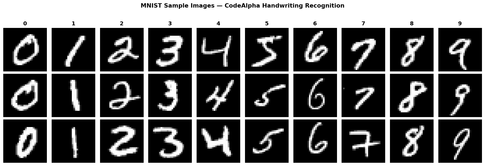
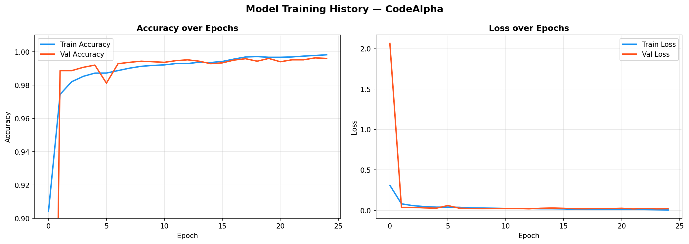
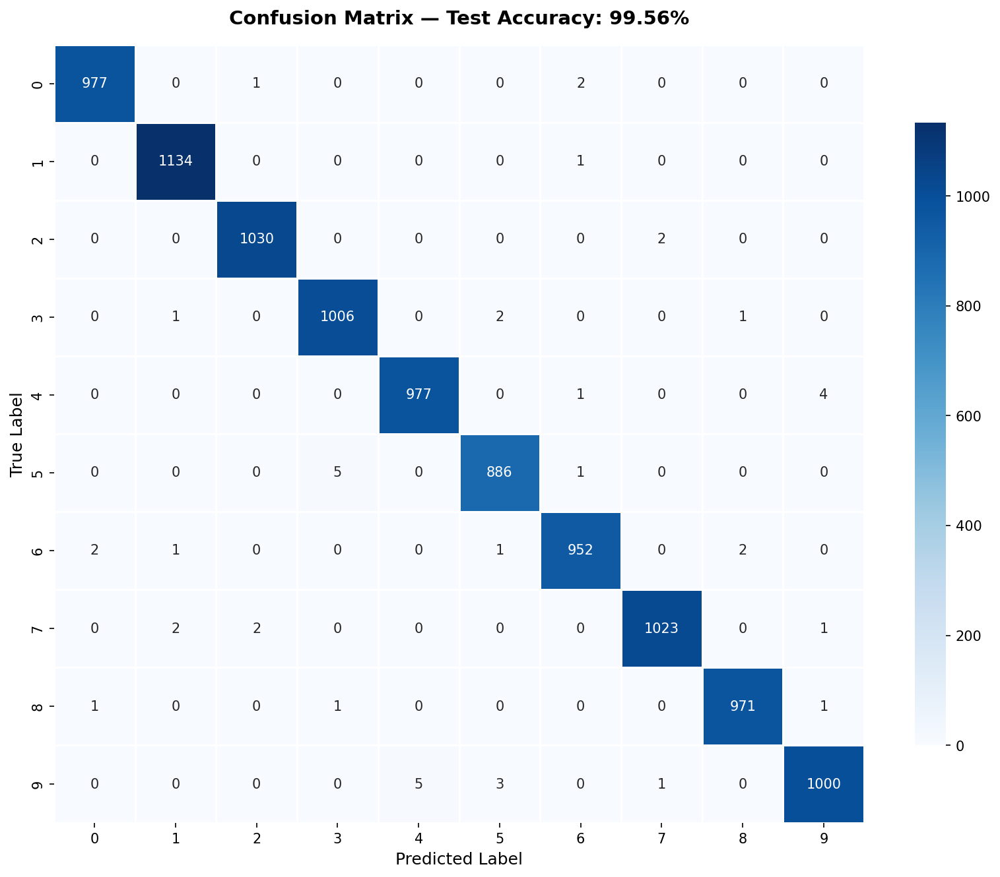
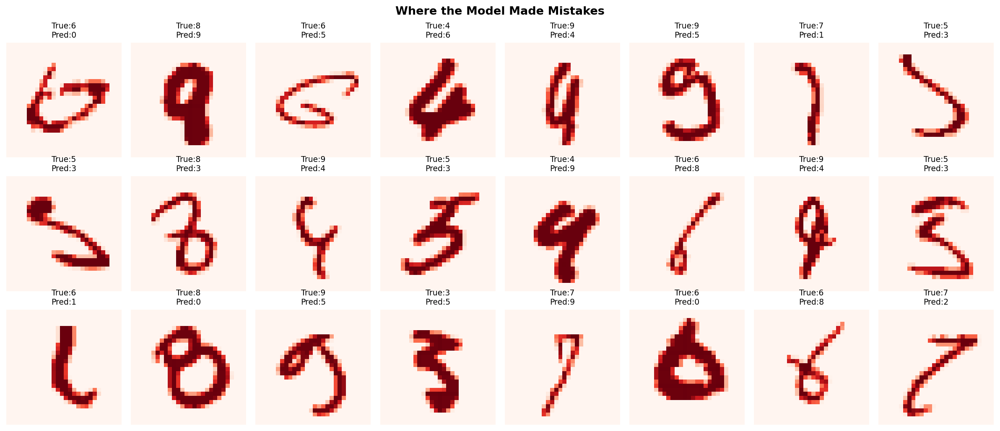
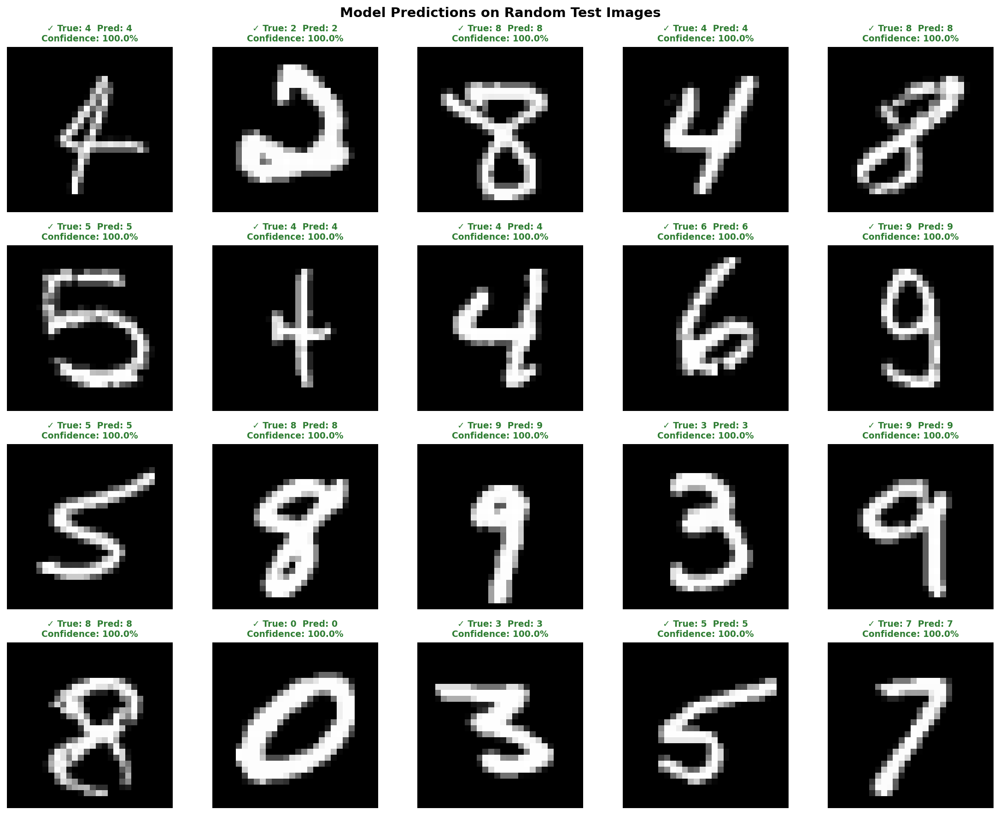

# ✍️ Handwritten Character Recognition
### CodeAlpha Machine Learning Internship — Task 3


---

# 📌 Project Overview

This project is a deep learning based handwritten digit recognition system built using a **Convolutional Neural Network (CNN)** trained on the **MNIST dataset**.

The system can:
- Recognize handwritten digits from **0–9**
- Predict digits using a trained CNN model
- Test on random MNIST images
- Predict custom handwritten images
- Run as an interactive browser-based web application

The final model achieved an impressive **99.56% test accuracy**.

---

# 🌐 Web Application Feature

A fully interactive web application was also developed using **Flask + HTML/CSS/JavaScript**.

Users can:
- Draw digits directly in the browser
- Get real-time predictions
- View prediction confidence
- See top 3 predicted digits
- Visualize probability distribution for all digits

---

# 🧠 Model Architecture

```text
Input (28×28×1)
    │
    ▼
Conv2D(32) → BatchNorm → Conv2D(32) → MaxPool → Dropout(0.25)
    │
    ▼
Conv2D(64) → BatchNorm → Conv2D(64) → MaxPool → Dropout(0.25)
    │
    ▼
Conv2D(128) → BatchNorm → MaxPool → Dropout(0.25)
    │
    ▼
Flatten → Dense(256) → BatchNorm → Dropout(0.5)
    │
    ▼
Dense(10, softmax) → Predicted Digit
```

---

# ⚙️ Model Details

| Component | Details |
|---|---|
| Framework | TensorFlow / Keras |
| Architecture | CNN (Convolutional Neural Network) |
| Optimizer | Adam |
| Loss Function | Sparse Categorical Crossentropy |
| Dataset | MNIST |
| Epochs | 25 |
| Batch Size | 128 |
| Total Parameters | 438,506 |
| Final Test Accuracy | 99.56% |

---

# 📊 Final Results

| Metric | Score |
|---|---|
| Test Accuracy | **99.56%** |
| Test Loss | **0.0143** |
| Precision | **99%+** |
| Recall | **99%+** |
| F1-Score | **99%+** |

---

# 📁 Project Structure

```text
CodeAlpha_HandwrittenCharacterRecognition/
│
├── app.py
├── handwriting_model.py
├── predict.py
├── README.md
│
├── templates/
│   └── index.html
│
├── sample_images.png
├── training_history.png
├── confusion_matrix.png
├── wrong_predictions.png
├── predictions_random.png
│
├── best_model.h5
└── handwriting_cnn_final.h5
```

---

# 🚀 How to Run

## 1️⃣ Install Dependencies

```bash
pip install tensorflow numpy matplotlib seaborn scikit-learn pillow flask
```

---

## 2️⃣ Train the Model

```bash
python handwriting_model.py
```

This will:
- Download the MNIST dataset automatically
- Train the CNN model
- Save the best trained model
- Generate visualization images
- Save the final `.h5` model

---

## 3️⃣ Run Prediction Script

### Predict on random MNIST images

```bash
python predict.py
```

### Predict on your own handwritten image

```bash
python predict.py --image your_digit.png
```

---

## 4️⃣ Run the Web Application

```bash
python app.py
```

Then open:

```text
http://127.0.0.1:5000
```

You can now:
- Draw digits in the browser
- Click Predict
- Get AI predictions instantly

---

# 🖥️ Browser-Based Digit Recognition UI

The web interface includes:
- Interactive drawing canvas
- Adjustable brush size
- Real-time prediction
- Confidence score
- Top 3 predictions
- Probability visualization

---

# 📸 Sample Dataset Images



---

# 📈 Training History

This graph shows:
- Accuracy increasing over epochs
- Loss decreasing during training



---

# 🔥 Confusion Matrix

The confusion matrix visualizes model performance across all digit classes.



---

# ❌ Wrong Predictions

Examples where the model predicted incorrectly.



---

# 🎯 Random Prediction Results

Prediction results on random MNIST test images using `predict.py`.



---

# 🛠️ Technologies Used

| Tool | Purpose |
|---|---|
| Python | Programming Language |
| TensorFlow / Keras | Deep Learning |
| Flask | Web Application Backend |
| HTML/CSS/JavaScript | Frontend UI |
| NumPy | Numerical Operations |
| Matplotlib | Visualization |
| Seaborn | Heatmaps |
| Scikit-learn | Evaluation Metrics |
| Pillow | Image Processing |

---

# 📚 Dataset Information

## MNIST Dataset

The MNIST dataset contains:
- 60,000 training images
- 10,000 testing images
- Handwritten digits from 0–9
- 28×28 grayscale images

The dataset is automatically downloaded using TensorFlow/Keras.

---

# 💾 Output Files Generated

| File Name | Description |
|---|---|
| `sample_images.png` | Dataset preview |
| `training_history.png` | Accuracy and loss graphs |
| `confusion_matrix.png` | Model performance heatmap |
| `wrong_predictions.png` | Incorrect predictions |
| `predictions_random.png` | Random prediction testing |
| `handwriting_cnn_final.h5` | Final trained model |
| `best_model.h5` | Best validation model |

---

# ✨ Features

✅ CNN-based handwritten digit recognition  
✅ Interactive browser drawing canvas  
✅ Real-time predictions  
✅ Top-3 prediction probabilities  
✅ Visualization of training performance  
✅ Confusion matrix analysis  
✅ Wrong prediction analysis  
✅ Predict custom handwritten images  
✅ Flask web application integration  

---

# 👤 Author

## Shristi Upadhyay
CodeAlpha Machine Learning Intern

### 🔗 Connect With Me

- GitHub: https://github.com/shrxstii
- LinkedIn: https://www.linkedin.com/in/shristiupadhyay11/

---

# 🌟 Internship Task

This project was developed as part of the **CodeAlpha Machine Learning Internship Program**.

---